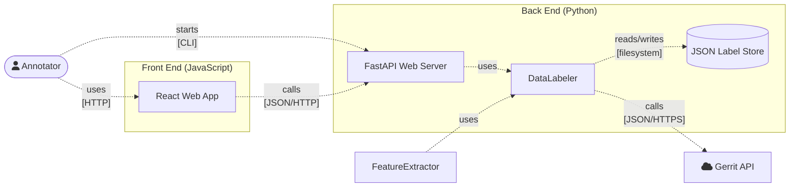

# MCR Annotation

## User guide

Setup:

```bash
pip install -r labels/requirements.txt
```

Start:

```bash
python -m labels
```

1. Visit http://127.0.0.1:8000.
2. You will be presented with a UI for code review comment labeling.
   - Current comment ID alongside a link is shown in the top-left corner.
   - Annotator email is shown in the top-right corner.
   - Annotation status can be shown by hovering the question mark to the right of the annotator email.
   - Possible labels (and a special SKIP button) are shown on the bottom bar.
   - The labels are described when hovering the question mark to the right of them.
   - The buttons are locked for the first few seconds to prevent miss clicks and invalid annotations.
   - Click any of the buttons when you are sure that the browsed comment belongs to the category.
   - Click the SKIP button if you are unsure about the category.
3. Press CTRL+C (or close the program using any other means) to end the labeling process.
4. Your labels should end up in the `proposed/labels/annotations` folder, validate them and commit to the VCS.

## Contributor guide

System architecture:



General notes:

- Python sources are formatted with [autopep8](https://pypi.org/project/autopep8).
- Python dependencies are listed in `proposed/labels/requirements.txt`.
- HTML, CSS and JS sources are formatted with [Prettier](https://prettier.io).
- JS dependencies are listed in `proposed/labels/client/js/lib.js`.
- To ensure minimal configuration overhead, the client code is created without using any tooling, bundlers, etc. (not even Node.js nor npm is required to run the project). This means that the project has to use pure JS, and specifically it can't use JSX. This can be achieved using [React&#39;s `createElement` API](https://react.dev/reference/react/createElement#creating-an-element-without-jsx). All client code should construct elements using the `h` function exported from `lib.js`.
